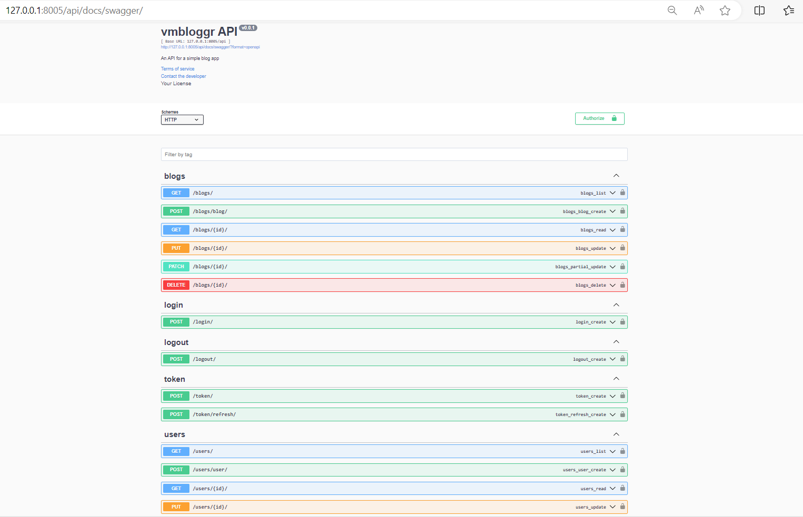
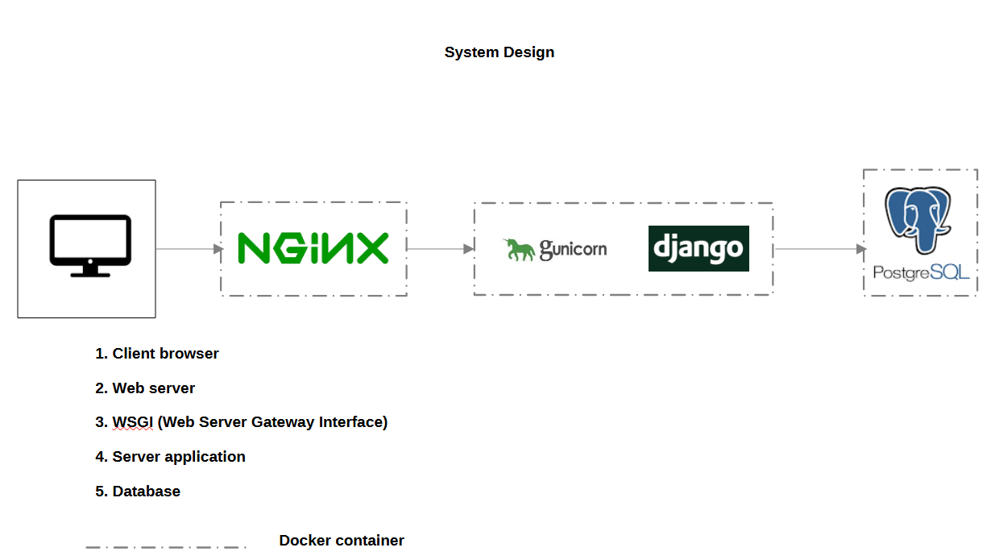
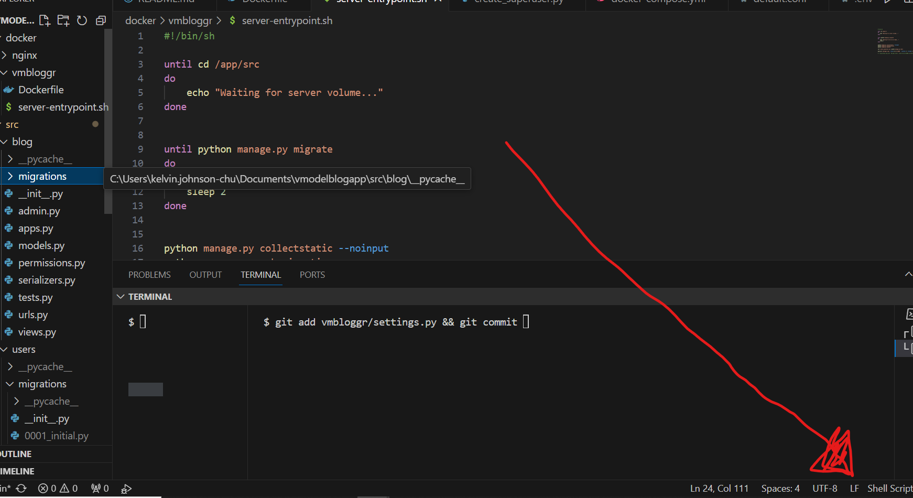

# vmbloggr


##

## A blogger's delight


Built using a combination of Django and DRF (the Django Rest Framework), vmbloggr is a RESTful API that serves as the backend server for a simple blogging platform. It allows users to 
* Register and login to the API
* Create blog posts
* Get a list of blog posts from the database
* View the details of each post
* Update existing blog posts
* Delete existing blog posts


### Project specifications
Within the project, the three apps worthy of note are:
1. users - Creation, authentication, update and deletion of user accounts 
2. blog - Creation, listing, update and deletion of blogs by authorised users  


## Getting Started

* Get a copy of the source code of this project into your local repository.

```
git clone https://github.com/KelvinJC/vmbloggr.git
```

* The code will be packaged in a directory named vmbloggr so change into that directory

```
cd vmbloggr
```

* To begin using the application, initiate the server by running the following command to build and run the containers in one go

```
docker compose up --build 
```
#### Note:
Adding the extra flag `-f docker-compose.yml` to the command works as well 
but since the docker-compose file is bearing the default name - "docker-compose.yml" 
that is no longer unnecessary


### Running the server:
By default, Django apps listen on port 8000 so once the server is running, 
copy and paste ```http://127.0.0.1:8000/api``` into your preferred browser.<br>

To prevent clashes on port 8000, make sure no other Django app is running on localhost.


### Documentation
While the default Django DRF documentation is available, the preference for this project is Swagger docs. <br>
vmbloggr relies on Swagger for documentation which can be accessed at

```http://127.0.0.1:8000/api/docs/swagger``` 

You can view the full documentation of the API as well as interact with all its endpoints (even to authenticate a user!) <br>
just as you would on Postman or any other API client.





### Authentication and Authorisation.

JWT authentication ensures that users are properly authenticated. 
This serves to ensure that only authors can update or delete their posts

### Database choice
This project makes use of a Postgres database which is within a separate docker container 
for persistent storage of blog posts as well as user information. 

If you require a different database, customisation is possible via the settings.py file. <br><br>


### Django Admin User
This step is not critical to the usage of the app but if you are familiar with the Django Admin UI you can make use of an already created superuser 

```
username = Admin
password = Admin
```

To access the Django Admin UI visit ```http://127.0.0.1:8000/admin```

#### Credentials and .env files: 
No credentials should be stored in code repositories! <br>
They belong in .env files which must be kept secret and remain local to the appropriate context (e.g. dev, test or prod). 

The admin credentials above as well as the .env file in this project were committed to the repo 
in this unique case to facilitate your ease in spinning up the dockerised app.


### Automated tests. 
Tests are pretty important. To aid test-driven development, ```vmbloggr``` comes with a test suite in each app. <br>
Tests have been written for each endpoint of the API.
To run all tests, at the moment, it is preferable to run the project locally i.e without starting the docker containers.


1. Navigate to the ```src``` directory

```
cd src
```

2. Run the relevant django management command to initiate all current django tests<br>

```
python manage.py test
```

### System design
The system consists of an NGINX web server to handle HTTP requests from a client browser. It in turn forwards these requests to the Django application server through an intermediary Gunicorn web server gateway interface.
The persistence layer is a Postgres database. This handles data query requests from the application server.

The gateway interface and application server reside within the same Docker container while the database and web server rest in separate Docker containers. Since all services share a single Docker Compose configuration file, they share the same network within a host OS.




#### POSSIBLE ERROR ON WINDOWS OS: Container exits right after build 
This can be fixed by taking the following steps:
1. Open the project in VSCode, navigate to the shell script at this path

``` vmbloggr/docker/vmbloggr/server-entry.sh ```

2. If the file ending indicator on the bottom right displays CRLF, click on it and switch to LF. (Look at the screenshot below.)

3. Then rerun the docker compose up --build command at the project's root directory.
(It is a file ending error associated with pushing shell scripts to a git repo from a Windows OS)



